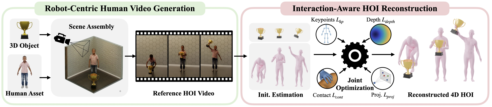
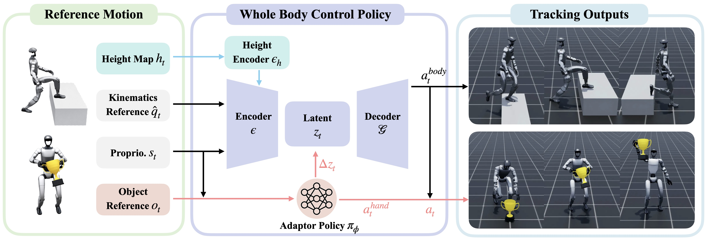

GRAIL Documentation
===================

.. raw:: html

   

     
     
     
     
   

.. image:: ../../assets/videos/teaser.gif
   :alt: GRAIL teaser
   :align: center
   :width: 100%

GRAIL — *Generating Humanoid Loco-Manipulation from 3D Assets and Video Priors* —
is a fully digital data-generation pipeline for robot-compatible humanoid
loco-manipulation. It composes 3D assets, simulator-ready scenes,
robot-proportioned characters, and video foundation model priors to synthesize
interactions in known metric 3D configurations, then reconstructs 4D
human-object trajectories, retargets them to the Unitree G1, and trains
task-general manipulation and locomotion trackers. The resulting egocentric
visual policies transfer from GRAIL-generated data to real-world object
pick-up and stair-climbing.

.. tip::

   **New here?** Start with :doc:`installation`, then
   :doc:`quick_start` for a 5-minute smoke run.

News
----

- **2026-06** — Released code on `GitHub <https://github.com/NVlabs/GRAIL>`_ and dataset on `HuggingFace <https://huggingface.co/datasets/nvidia/PhysicalAI-Robotics-Locomanipulation-GRAIL>`_.
- **2026-04** — Project page launched at
  `research.nvidia.com/labs/dair/grail
  <https://research.nvidia.com/labs/dair/grail/>`_.

Pipeline at a glance
--------------------

.. code-block:: text

   Text / asset prompt
           ↓
   python -m grail.pipelines.gen_terrain / python -m grail.pipelines.gen_3d_assets
           →  3D object meshes
           ↓
   python -m grail.pipelines.gen_2dhoi
           →  Blender + Kling AI HOI videos
           ↓
   python -m grail.pipelines.recon_4dhoi
           →  SMPL-X body + object 4D trajectories
           ↓
   imports/GMR (retarget)               →  Unitree G1 joint trajectories
           ↓
   imports/SONIC                        →  Task-general tracking policy training

Sim-to-Real Deployment
----------------------

Representative real Unitree G1 deployment results are included for object
pick-up and stair-climbing, alongside rendered egocentric views used for
visual-policy training.

Rendered Egocentric Views
~~~~~~~~~~~~~~~~~~~~~~~~~

.. image:: ../../assets/videos/deployment_egocentric_views.gif
   :alt: Rendered egocentric views for policy training
   :align: center
   :width: 100%

Real-World Deployment
~~~~~~~~~~~~~~~~~~~~~

.. list-table::
   :widths: 50 50
   :header-rows: 1

   * - Real-world Pick-up
     - Real-world Stair-Climbing
   * - .. image:: ../../assets/videos/deployment_pickup.gif
          :alt: Real-world pick-up deployment
          :width: 100%
     - .. image:: ../../assets/videos/deployment_stairs.gif
          :alt: Real-world stair-climbing deployment
          :width: 100%

Bundled Dependencies
--------------------

.. list-table::
   :header-rows: 1
   :widths: 25 40 35

   * - Path
     - Upstream
     - Purpose
   * - ``imports/SONIC``
     - GRAIL-vendored SONIC release tree
     - RL training, inference, deploy stack
   * - ``imports/GMR``
     - `YanjieZe/GMR <https://github.com/YanjieZe/GMR>`_
     - SMPL-X → robot retargeting engine
   * - ``imports/GEM-SMPL``, ``imports/GEM-SOMA``
     - NVLabs GENMO / GEM-X
     - Human pose estimation
   * - ``imports/FoundationPose``
     - `NVlabs/FoundationPose <https://github.com/NVlabs/FoundationPose>`_
     - Object 6-DOF tracking
   * - ``imports/MoGe``, ``imports/Hunyuan3D-2.1``
     - Microsoft, Tencent
     - Monocular depth + 3D asset generation

Initialize with:

.. code-block:: bash

   git submodule update --init --recursive

.. toctree::
   :maxdepth: 2
   :caption: Getting Started

   installation
   quick_start

.. toctree::
   :maxdepth: 2
   :caption: Pipelines

   gen_3d_assets
   gen_2dhoi
   recon_4dhoi
   retargeting
   tracking

.. toctree::
   :maxdepth: 2
   :caption: Data Exploration

   data_export
   visualization
   web_visualizer

Indices and tables
==================

* :ref:`genindex`
* :ref:`search`
